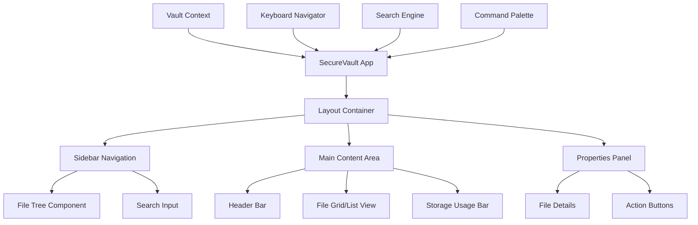
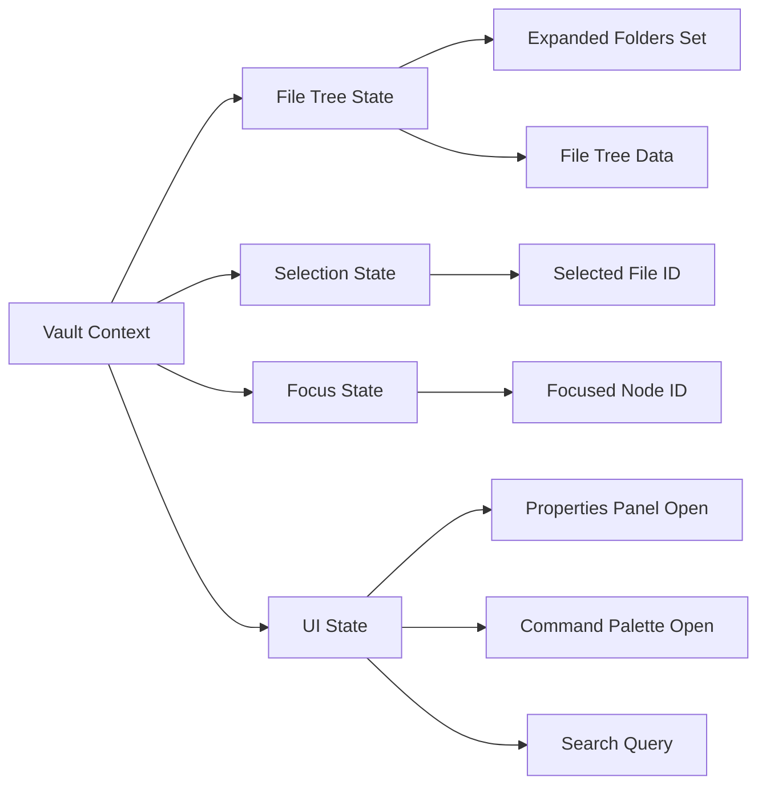

# SecureVault File Explorer - Design Document

## Overview

SecureVault is an enterprise-grade file explorer web application designed for law firms and banks, featuring a sophisticated dark theme interface with Linear.app-level polish. The application provides secure file management with hierarchical navigation, advanced search capabilities, comprehensive keyboard shortcuts, and full accessibility support.

The design emphasizes security, professionalism, and usability through a carefully crafted dark theme that conveys "cyber-secure, precise, and fast" characteristics. The interface follows enterprise software patterns while maintaining modern web application standards.

## Architecture

### System Architecture

The SecureVault application follows a component-based React architecture with centralized state management:



### State Management Architecture



### Component Hierarchy

- **SecureVault** (Root Container)
  - **LayoutContainer** (CSS Grid Layout)
    - **Sidebar**
      - **NavigationMenu**
      - **SearchInput**
      - **FileTree**
        - **FileTreeNode** (Recursive)
    - **MainContent**
      - **HeaderBar**
        - **Breadcrumb**
        - **ActionButtons**
      - **FileGrid**
        - **FileCard**
      - **StorageUsageBar**
    - **PropertiesPanel**
      - **FileDetails**
      - **ActionButtons**
  - **CommandPalette** (Modal Overlay)
  - **KeyboardNavigator** (Global Handler)

## Components and Interfaces

### Core Layout Components

#### SecureVault Container
```typescript
interface SecureVaultProps {
  data: FileTreeData;
  theme?: 'dark' | 'light';
  onFileSelect?: (file: FileNode) => void;
}
```

**Styling Specifications:**
- Background: `#0A0C10` (very dark blue/black)
- CSS Grid layout: `280px 1fr 320px` (sidebar, main, properties)
- Font family: Inter for UI text, JetBrains Mono for technical data
- Custom scrollbar styling throughout

#### Sidebar Navigation
```typescript
interface SidebarProps {
  currentPath: string[];
  onNavigate: (path: string[]) => void;
}
```

**Visual Design:**
- Background: `#1a1d29` (dark blue)
- Width: 280px fixed
- Navigation items with icons and labels
- Active state highlighting with blue accent

#### Main Content Area
```typescript
interface MainContentProps {
  files: FileNode[];
  viewMode: 'grid' | 'list';
  onViewModeChange: (mode: 'grid' | 'list') => void;
}
```

**Layout Structure:**
- Header bar with breadcrumb navigation
- Flexible content area for file display
- Bottom storage usage indicator

### File Tree Components

#### FileTree Component
```typescript
interface FileTreeProps {
  data: FileTreeData;
  expandedFolders: Set<string>;
  selectedFileId?: string;
  focusedNodeId?: string;
  searchQuery?: string;
  onToggleFolder: (folderId: string) => void;
  onSelectFile: (fileId: string) => void;
  onFocusNode: (nodeId: string) => void;
}
```

**Key Features:**
- Recursive rendering for arbitrary nesting depth
- Smooth expand/collapse animations (200ms ease-out)
- Visual hierarchy with 16px indentation per level
- Search highlighting and filtering

#### FileTreeNode Component
```typescript
interface FileTreeNodeProps {
  node: FileNode;
  level: number;
  isExpanded?: boolean;
  isSelected?: boolean;
  isFocused?: boolean;
  searchQuery?: string;
  onToggle?: () => void;
  onSelect?: () => void;
  onFocus?: () => void;
}
```

**Visual States:**
- **Default**: Dark background with subtle borders
- **Focused**: 2px blue focus ring with 2px offset (`#3B82F6`)
- **Selected**: 3px left border in blue + 8% blue opacity background
- **Hover**: Subtle background lightening

### File Card Components

#### FileCard Component
```typescript
interface FileCardProps {
  file: FileNode;
  isSelected: boolean;
  onSelect: () => void;
  onDoubleClick?: () => void;
}
```

**Design Specifications:**
- Rounded corner cards with dark gray/blue background
- File type icons with consistent sizing
- Encryption badges for secure files
- Selected state with blue accent border (`#3B82F6`)
- Hover effects with smooth transitions

### Properties Panel

#### PropertiesPanel Component
```typescript
interface PropertiesPanelProps {
  file?: FileNode;
  isOpen: boolean;
  onClose: () => void;
  onDownload?: (file: FileNode) => void;
  onShare?: (file: FileNode) => void;
  onDelete?: (file: FileNode) => void;
}
```

**Animation Behavior:**
- Slide in from right with 250ms translateX transition
- Width: 320px fixed
- Backdrop blur when open on mobile

### Search and Navigation

#### CommandPalette Component
```typescript
interface CommandPaletteProps {
  isOpen: boolean;
  onClose: () => void;
  onSelectItem: (item: FileNode) => void;
  files: FileNode[];
}
```

**Features:**
- Full-screen overlay with backdrop blur
- Auto-focus search input
- Grouped results (Folders/Files)
- Keyboard navigation support
- Recent items when query is empty

#### SearchInput Component
```typescript
interface SearchInputProps {
  value: string;
  onChange: (value: string) => void;
  onClear: () => void;
  placeholder?: string;
}
```

## Data Models

### Core Data Structures

#### FileNode Interface
```typescript
interface FileNode {
  id: string;
  name: string;
  type: 'file' | 'folder';
  
  // File-specific properties
  fileType?: string;
  size?: number;
  modified?: Date;
  owner?: string;
  encrypted?: boolean;
  
  // Folder-specific properties
  children?: FileNode[];
  
  // Computed properties
  path?: string[];
  depth?: number;
}
```

#### FileTreeData Interface
```typescript
interface FileTreeData {
  root: FileNode;
  totalFiles: number;
  totalSize: number;
  lastModified: Date;
}
```

#### VaultState Interface
```typescript
interface VaultState {
  // Tree state
  fileTree: FileTreeData;
  expandedFolders: Set<string>;
  
  // Selection state
  selectedFileId?: string;
  focusedNodeId?: string;
  
  // UI state
  propertiesPanelOpen: boolean;
  commandPaletteOpen: boolean;
  searchQuery: string;
  viewMode: 'grid' | 'list';
  
  // Navigation state
  currentPath: string[];
  breadcrumb: BreadcrumbItem[];
}
```

#### BreadcrumbItem Interface
```typescript
interface BreadcrumbItem {
  id: string;
  name: string;
  path: string[];
}
```

### Data Validation Schema

```typescript
const FileNodeSchema = {
  id: { type: 'string', required: true },
  name: { type: 'string', required: true },
  type: { type: 'enum', values: ['file', 'folder'], required: true },
  fileType: { type: 'string', required: false },
  size: { type: 'number', required: false },
  modified: { type: 'date', required: false },
  owner: { type: 'string', required: false },
  encrypted: { type: 'boolean', required: false, default: false },
  children: { type: 'array', items: 'FileNode', required: false }
};
```

## Design System

### Color Palette

#### Dark Theme Colors
```css
:root {
  /* Primary backgrounds */
  --bg-primary: #0A0C10;        /* Main background */
  --bg-secondary: #1a1d29;      /* Sidebar background */
  --bg-tertiary: #2E3340;       /* Card backgrounds */
  
  /* Interactive colors */
  --accent-primary: #3B82F6;    /* Blue accent */
  --accent-hover: #2563EB;      /* Darker blue for hover */
  --accent-light: rgba(59, 130, 246, 0.08); /* Light blue overlay */
  
  /* Text colors */
  --text-primary: #F9FAFB;      /* Primary text */
  --text-secondary: #9CA3AF;    /* Secondary text */
  --text-muted: #6B7280;        /* Muted text */
  
  /* Border colors */
  --border-primary: #374151;    /* Primary borders */
  --border-focus: #3B82F6;      /* Focus borders */
  
  /* Status colors */
  --success: #10B981;           /* Green for encryption badges */
  --warning: #F59E0B;           /* Orange for warnings */
  --error: #EF4444;             /* Red for errors */
  
  /* Scrollbar colors */
  --scrollbar-track: #2E3340;
  --scrollbar-thumb: #4B5563;
}
```

### Typography System

#### Font Definitions
```css
@import '@fontsource/inter/400.css';
@import '@fontsource/inter/500.css';
@import '@fontsource/inter/600.css';
@import '@fontsource/jetbrains-mono/400.css';
@import '@fontsource/jetbrains-mono/500.css';

:root {
  --font-primary: 'Inter', -apple-system, BlinkMacSystemFont, sans-serif;
  --font-mono: 'JetBrains Mono', 'SF Mono', Monaco, monospace;
}
```

#### Typography Scale
```css
.text-xs { font-size: 0.75rem; line-height: 1rem; }      /* 12px */
.text-sm { font-size: 0.875rem; line-height: 1.25rem; }  /* 14px */
.text-base { font-size: 1rem; line-height: 1.5rem; }     /* 16px */
.text-lg { font-size: 1.125rem; line-height: 1.75rem; }  /* 18px */
.text-xl { font-size: 1.25rem; line-height: 1.75rem; }   /* 20px */
.text-2xl { font-size: 1.5rem; line-height: 2rem; }      /* 24px */
```

### Spacing System

```css
:root {
  --space-1: 0.25rem;   /* 4px */
  --space-2: 0.5rem;    /* 8px */
  --space-3: 0.75rem;   /* 12px */
  --space-4: 1rem;      /* 16px */
  --space-5: 1.25rem;   /* 20px */
  --space-6: 1.5rem;    /* 24px */
  --space-8: 2rem;      /* 32px */
  --space-12: 3rem;     /* 48px */
  --space-16: 4rem;     /* 64px */
}
```

### Component Styling Specifications

#### File Tree Node Styling
```css
.file-tree-node {
  padding: var(--space-2) var(--space-3);
  border-radius: 0.375rem;
  transition: all 0.15s ease;
  font-family: var(--font-primary);
  
  &:hover {
    background-color: rgba(255, 255, 255, 0.05);
  }
  
  &.focused {
    outline: 2px solid var(--border-focus);
    outline-offset: 2px;
  }
  
  &.selected {
    background-color: var(--accent-light);
    border-left: 3px solid var(--accent-primary);
  }
}

.file-tree-node__name {
  font-size: 0.875rem;
  color: var(--text-primary);
  font-weight: 400;
}

.file-tree-node__size {
  font-family: var(--font-mono);
  font-size: 0.75rem;
  color: var(--text-secondary);
  text-align: right;
}

.file-tree-node__count {
  font-family: var(--font-mono);
  font-size: 0.75rem;
  color: var(--text-muted);
}
```

#### File Card Styling
```css
.file-card {
  background: var(--bg-tertiary);
  border: 1px solid var(--border-primary);
  border-radius: 0.5rem;
  padding: var(--space-4);
  transition: all 0.2s ease;
  cursor: pointer;
  
  &:hover {
    border-color: var(--accent-primary);
    transform: translateY(-1px);
    box-shadow: 0 4px 12px rgba(0, 0, 0, 0.15);
  }
  
  &.selected {
    border-color: var(--accent-primary);
    border-width: 2px;
    box-shadow: 0 0 0 1px var(--accent-primary);
  }
}

.file-card__icon {
  width: 2.5rem;
  height: 2.5rem;
  margin-bottom: var(--space-3);
}

.file-card__name {
  font-size: 0.875rem;
  font-weight: 500;
  color: var(--text-primary);
  margin-bottom: var(--space-1);
}

.file-card__meta {
  font-family: var(--font-mono);
  font-size: 0.75rem;
  color: var(--text-secondary);
}
```

#### Encryption Badge Styling
```css
.encryption-badge {
  display: inline-flex;
  align-items: center;
  gap: var(--space-1);
  padding: var(--space-1) var(--space-2);
  background: var(--success);
  color: white;
  border-radius: 0.25rem;
  font-size: 0.75rem;
  font-weight: 500;
  text-transform: uppercase;
}

.encryption-badge__icon {
  width: 0.875rem;
  height: 0.875rem;
}
```

### Animation Specifications

#### Folder Expand/Collapse Animation
```css
.folder-content {
  overflow: hidden;
  transition: height 200ms ease-out;
}

.folder-chevron {
  transition: transform 200ms ease-out;
  
  &.expanded {
    transform: rotate(90deg);
  }
}
```

#### Properties Panel Animation
```css
.properties-panel {
  transform: translateX(100%);
  transition: transform 250ms ease-out;
  
  &.open {
    transform: translateX(0);
  }
}
```

#### Command Palette Animation
```css
.command-palette-overlay {
  opacity: 0;
  backdrop-filter: blur(0px);
  transition: all 200ms ease-out;
  
  &.open {
    opacity: 1;
    backdrop-filter: blur(8px);
  }
}

.command-palette-content {
  transform: scale(0.95) translateY(-10px);
  opacity: 0;
  transition: all 200ms ease-out;
  
  &.open {
    transform: scale(1) translateY(0);
    opacity: 1;
  }
}
```

### Responsive Design Specifications

#### Breakpoints
```css
:root {
  --breakpoint-sm: 640px;
  --breakpoint-md: 768px;
  --breakpoint-lg: 1024px;
  --breakpoint-xl: 1280px;
}
```

#### Layout Adaptations
```css
.layout-container {
  display: grid;
  grid-template-columns: 280px 1fr 320px;
  height: 100vh;
  
  @media (max-width: 768px) {
    grid-template-columns: 1fr;
    grid-template-rows: auto 1fr auto;
  }
}

.properties-panel {
  @media (max-width: 768px) {
    position: fixed;
    bottom: 0;
    left: 0;
    right: 0;
    height: 60vh;
    border-radius: 1rem 1rem 0 0;
    transform: translateY(100%);
    
    &.open {
      transform: translateY(0);
    }
  }
}
```

### Accessibility Specifications

#### Focus Management
```css
.focus-visible {
  outline: 2px solid var(--border-focus);
  outline-offset: 2px;
  border-radius: 0.25rem;
}

.sr-only {
  position: absolute;
  width: 1px;
  height: 1px;
  padding: 0;
  margin: -1px;
  overflow: hidden;
  clip: rect(0, 0, 0, 0);
  white-space: nowrap;
  border: 0;
}
```

#### ARIA Attributes
```typescript
// File Tree ARIA attributes
const fileTreeProps = {
  role: 'tree',
  'aria-label': 'File explorer tree'
};

const fileNodeProps = {
  role: 'treeitem',
  'aria-level': level,
  'aria-expanded': isFolder ? isExpanded : undefined,
  'aria-selected': isSelected,
  tabIndex: isFocused ? 0 : -1
};

// Properties Panel ARIA attributes
const propertiesPanelProps = {
  role: 'complementary',
  'aria-label': 'File properties',
  'aria-live': 'polite'
};
```

## Keyboard Navigation System

### Keyboard Shortcuts

#### Global Shortcuts
- `Cmd/Ctrl + K`: Open Command Palette
- `Escape`: Close modals, deselect files
- `Tab`: Navigate between major UI sections
- `Shift + Tab`: Navigate backwards

#### File Tree Navigation
- `↑/↓`: Move focus up/down in tree
- `←`: Collapse folder or move to parent
- `→`: Expand folder
- `Enter`: Select file or toggle folder
- `Space`: Select file without opening
- `Home`: Focus first item
- `End`: Focus last item

#### Command Palette Navigation
- `↑/↓`: Navigate search results
- `Enter`: Select highlighted result
- `Escape`: Close palette
- `Tab`: Navigate between result groups

### Focus Management Implementation

```typescript
interface KeyboardNavigatorState {
  focusedNodeId?: string;
  focusMode: 'tree' | 'palette' | 'properties';
  shortcutLegendVisible: boolean;
}

class KeyboardNavigator {
  private focusableNodes: string[] = [];
  private currentIndex: number = 0;
  
  handleKeyDown(event: KeyboardEvent) {
    switch (event.key) {
      case 'ArrowUp':
        this.moveFocus(-1);
        break;
      case 'ArrowDown':
        this.moveFocus(1);
        break;
      case 'ArrowLeft':
        this.handleLeftArrow();
        break;
      case 'ArrowRight':
        this.handleRightArrow();
        break;
      case 'Enter':
        this.handleEnter();
        break;
      case 'Escape':
        this.handleEscape();
        break;
    }
  }
  
  scrollIntoView(nodeId: string) {
    const element = document.querySelector(`[data-node-id="${nodeId}"]`);
    element?.scrollIntoView({ 
      behavior: 'smooth', 
      block: 'nearest' 
    });
  }
}
```

## Performance Optimization Strategy

### React Optimization Patterns

#### Component Memoization
```typescript
const FileTreeNode = React.memo<FileTreeNodeProps>(({ 
  node, 
  level, 
  isExpanded, 
  isSelected, 
  isFocused 
}) => {
  // Component implementation
}, (prevProps, nextProps) => {
  // Custom comparison for optimal re-rendering
  return (
    prevProps.node.id === nextProps.node.id &&
    prevProps.isExpanded === nextProps.isExpanded &&
    prevProps.isSelected === nextProps.isSelected &&
    prevProps.isFocused === nextProps.isFocused
  );
});
```

#### Context Optimization
```typescript
// Separate contexts to minimize re-renders
const VaultStateContext = createContext<VaultState>();
const VaultDispatchContext = createContext<VaultDispatch>();

// Memoized selectors
const useSelectedFile = () => {
  const state = useContext(VaultStateContext);
  return useMemo(() => 
    state.fileTree.root.findById(state.selectedFileId),
    [state.fileTree, state.selectedFileId]
  );
};
```

#### Search Optimization
```typescript
const useSearchResults = (query: string, files: FileNode[]) => {
  return useMemo(() => {
    if (!query.trim()) return [];
    
    const results: FileNode[] = [];
    const searchLower = query.toLowerCase();
    
    const searchRecursive = (node: FileNode) => {
      if (node.name.toLowerCase().includes(searchLower)) {
        results.push(node);
      }
      if (node.children) {
        node.children.forEach(searchRecursive);
      }
    };
    
    files.forEach(searchRecursive);
    return results;
  }, [query, files]);
};
```

### CSS Performance Optimizations

#### Hardware Acceleration
```css
.file-tree-node,
.file-card,
.properties-panel {
  will-change: transform;
  transform: translateZ(0); /* Force hardware acceleration */
}
```

#### Efficient Animations
```css
/* Use transform and opacity for smooth animations */
.folder-content {
  transform: scaleY(0);
  transform-origin: top;
  transition: transform 200ms ease-out;
  
  &.expanded {
    transform: scaleY(1);
  }
}
```

## Security Considerations

### Data Protection
- No sensitive encryption keys displayed in UI
- File content never cached in browser storage
- Secure transmission protocols for all API calls
- Input sanitization for all user-provided data

### Access Control Integration
```typescript
interface SecurityContext {
  userPermissions: Permission[];
  fileAccessLevel: (fileId: string) => AccessLevel;
  canPerformAction: (action: string, fileId: string) => boolean;
}

enum AccessLevel {
  READ = 'read',
  WRITE = 'write',
  DELETE = 'delete',
  ADMIN = 'admin'
}
```

### Audit Trail Support
```typescript
interface AuditEvent {
  timestamp: Date;
  userId: string;
  action: string;
  fileId: string;
  metadata?: Record<string, any>;
}

const auditLogger = {
  logFileAccess: (fileId: string) => void,
  logFileDownload: (fileId: string) => void,
  logFileShare: (fileId: string, recipients: string[]) => void,
  logFileDelete: (fileId: string) => void
};
```

This design document provides comprehensive specifications for implementing the SecureVault file explorer with pixel-perfect accuracy to the provided screenshots while maintaining enterprise-grade security and accessibility standards.

## Correctness Properties

*A property is a characteristic or behavior that should hold true across all valid executions of a system-essentially, a formal statement about what the system should do. Properties serve as the bridge between human-readable specifications and machine-verifiable correctness guarantees.*

After analyzing the acceptance criteria, I've identified several redundancies that can be consolidated:

**Property Reflection:**
- Properties about folder expansion/collapse behavior (2.1, 2.4, 5.2, 5.3, 5.6) can be combined into comprehensive folder state management properties
- Properties about selection behavior (3.1, 3.4, 5.5) can be consolidated into selection state properties  
- Properties about keyboard navigation (5.1, 5.4, 5.8) can be combined into navigation behavior properties
- Properties about search highlighting (7.5, 8.4) can be unified into search highlighting properties
- Properties about ARIA attributes (10.1, 10.2, 10.3) can be combined into accessibility compliance properties
- Properties about font usage (15.1, 15.2, 15.3, 15.4) can be consolidated into typography consistency properties

### Property 1: Recursive Tree Rendering

*For any* file tree data structure with arbitrary nesting depth, the File_Tree component should render all nodes correctly with proper hierarchical relationships preserved.

**Validates: Requirements 1.1, 12.3**

### Property 2: Folder State Management

*For any* folder in the tree, expanding and collapsing operations should maintain consistent state in the Vault_Context, with chevron rotation and child visibility reflecting the current expanded state.

**Validates: Requirements 2.1, 2.3, 2.4, 5.2, 5.3, 5.6**

### Property 3: Visual Hierarchy Consistency

*For any* expanded folder structure, child nodes should be indented by exactly 16px per depth level, and folder item counts should be displayed in JetBrains Mono font.

**Validates: Requirements 1.2, 1.3**

### Property 4: File Display Formatting

*For any* file node in the tree, the file size should be displayed right-aligned in monospace text, and all file metadata should follow consistent formatting rules.

**Validates: Requirements 1.4**

### Property 5: Selection State Management

*For any* file selection operation, only one file should be selected at a time, with the selected file maintaining its state until a different file is selected or the selection is cleared.

**Validates: Requirements 3.1, 3.4, 3.5, 5.5**

### Property 6: Selection Visual Indicators

*For any* selected file, the visual display should include a 3px left border in #3B82F6 color and an 8% blue opacity background color.

**Validates: Requirements 3.2, 3.3**

### Property 7: Properties Panel Information Display

*For any* selected file, the Properties Panel should display all required information including file icon, name, type badge, size, modified date, and owner information.

**Validates: Requirements 4.2, 4.4**

### Property 8: Encryption Badge Display

*For any* file with the encrypted property set to true, the Properties Panel should display an AES-256 green badge with shield icon, while ensuring no sensitive security information is exposed.

**Validates: Requirements 4.3, 13.1, 13.2, 13.4, 13.5**

### Property 9: Properties Panel State Management

*For any* Properties Panel close operation, the panel should close and deselect the current file, returning the interface to its unselected state.

**Validates: Requirements 4.5, 5.7**

### Property 10: Keyboard Navigation Behavior

*For any* keyboard navigation operation (Up/Down arrows), focus should move to the previous/next visible node in the tree, with the focused item scrolled into view using nearest block positioning.

**Validates: Requirements 5.1, 5.8**

### Property 11: Parent Navigation

*For any* file node, pressing the Left arrow key should move focus to the parent folder, maintaining proper navigation hierarchy.

**Validates: Requirements 5.4**

### Property 12: Focus Visual Indicators

*For any* focused item, the display should include a 2px #3B82F6 focus ring with 2px offset, and the focus state should be maintained in Vault_Context as focusedNodeId.

**Validates: Requirements 6.1, 6.2**

### Property 13: Accessibility Compliance

*For any* interactive element in the File_Tree, proper ARIA roles (tree, treeitem), aria-level, aria-expanded, and aria-selected attributes should be present and correctly reflect the current state.

**Validates: Requirements 10.1, 10.2, 10.3, 10.6**

### Property 14: Focus Management

*For any* focus change that targets a collapsed folder's child, the system should automatically expand all ancestor folders to make the target visible.

**Validates: Requirements 6.5**

### Property 15: Command Palette Activation

*For any* Cmd+K or Ctrl+K key press, the Command Palette should open with full-screen overlay and auto-focus the search input field.

**Validates: Requirements 7.1, 7.2**

### Property 16: Search Algorithm Behavior

*For any* search query entered in the Command Palette, the Search_Engine should return matching files and folders using case-insensitive substring matching.

**Validates: Requirements 7.3**

### Property 17: Search Result Organization

*For any* search results, the Command Palette should group results into "Folders" and "Files" sections with full file paths displayed in muted monospace text.

**Validates: Requirements 7.4, 7.6**

### Property 18: Search Highlighting

*For any* search query with results, matched substrings should be highlighted in blue within result names across both Command Palette and inline tree search.

**Validates: Requirements 7.5, 8.4**

### Property 19: Command Palette Navigation

*For any* Up/Down arrow key press in the Command Palette, navigation should move through search results, and Enter should close the palette, select the item, expand ancestor folders, and scroll to show the item.

**Validates: Requirements 7.7, 7.8**

### Property 20: Command Palette State Management

*For any* Escape key press or empty search query, the Command Palette should close and restore previous focus, or display recent items respectively.

**Validates: Requirements 7.9, 7.10**

### Property 21: Inline Search Filtering

*For any* search text entered in the sidebar search input, non-matching nodes should be dimmed to 30% opacity, and folders containing matching items should auto-expand.

**Validates: Requirements 8.2, 8.3**

### Property 22: Search Filter Reset

*For any* clear button click in the inline search, all filters should reset and normal opacity should be restored to all nodes.

**Validates: Requirements 8.5**

### Property 23: Responsive Layout Management

*For any* screen width change, the CSS Grid layout should adapt appropriately: 280px sidebar + flexible center + 320px properties panel on desktop, and vertical stacking below 768px width.

**Validates: Requirements 9.1, 9.2, 9.3**

### Property 24: Mobile Properties Panel

*For any* mobile viewport, the Properties Panel should display as a bottom sheet instead of a side panel.

**Validates: Requirements 9.4**

### Property 25: Accessibility Announcements

*For any* file selection change, the Properties Panel should use aria-live="polite" to announce changes, and the Command Palette should implement focus trapping while open.

**Validates: Requirements 10.4, 10.5**

### Property 26: Color Contrast Compliance

*For any* text and interactive element, WCAG AA color contrast ratios should be maintained for accessibility compliance.

**Validates: Requirements 6.4, 10.7**

### Property 27: Performance Optimization

*For any* FileTreeNode component, React.memo should prevent unnecessary re-renders, and the Vault_Context should use separate state and dispatch contexts to minimize consumer re-renders.

**Validates: Requirements 11.1, 11.2**

### Property 28: Search Performance

*For any* expensive search computation, useMemo should be used with appropriate dependencies to optimize performance.

**Validates: Requirements 11.3**

### Property 29: Animation Implementation

*For any* animation in the File_Tree, CSS-only animations should be used without JavaScript animation libraries.

**Validates: Requirements 11.4**

### Property 30: Large Dataset Performance

*For any* file tree with 100+ nodes, the system should handle rendering efficiently without requiring virtualization.

**Validates: Requirements 11.5**

### Property 31: Data Structure Validation

*For any* JSON data input, the system should validate required properties (id, name, type) and provide meaningful error messages for invalid data, while gracefully handling missing optional properties with appropriate defaults.

**Validates: Requirements 12.1, 12.2, 12.4, 12.5**

### Property 32: Encryption Status Distinction

*For any* file comparison between encrypted and unencrypted files, the Properties Panel should clearly distinguish between them through visual indicators.

**Validates: Requirements 13.3**

### Property 33: Custom Scrollbar Styling

*For any* scrollable region, custom scrollbar styling should be applied with 4px width, #2E3340 track color, and #4B5563 thumb color with rounded corners.

**Validates: Requirements 14.1, 14.2, 14.3, 14.4**

### Property 34: Typography Consistency

*For any* text element, Inter font should be used for primary text content, while JetBrains Mono should be used consistently for file sizes, item counts, and file paths.

**Validates: Requirements 15.1, 15.2, 15.3, 15.4**

## Error Handling

### Input Validation Errors

The system implements comprehensive error handling for various failure scenarios:

#### Invalid Data Structure Errors
```typescript
interface ValidationError {
  field: string;
  message: string;
  code: 'MISSING_REQUIRED' | 'INVALID_TYPE' | 'INVALID_FORMAT';
}

const validateFileNode = (node: any): ValidationError[] => {
  const errors: ValidationError[] = [];
  
  if (!node.id) {
    errors.push({
      field: 'id',
      message: 'File node must have a unique identifier',
      code: 'MISSING_REQUIRED'
    });
  }
  
  if (!node.name) {
    errors.push({
      field: 'name',
      message: 'File node must have a name',
      code: 'MISSING_REQUIRED'
    });
  }
  
  if (!['file', 'folder'].includes(node.type)) {
    errors.push({
      field: 'type',
      message: 'File node type must be either "file" or "folder"',
      code: 'INVALID_TYPE'
    });
  }
  
  return errors;
};
```

#### Search and Navigation Errors
- **Empty Search Results**: Display "No files found" message with search suggestions
- **Invalid Navigation**: Gracefully handle attempts to navigate to non-existent paths
- **Focus Management Errors**: Restore focus to last valid position if target becomes unavailable

#### Performance Degradation Handling
- **Large Dataset Warning**: Display warning when tree exceeds 1000 nodes
- **Search Timeout**: Implement 5-second timeout for complex search operations
- **Memory Management**: Clear unused search results and collapsed folder contents

#### Accessibility Errors
- **Screen Reader Compatibility**: Provide fallback text for all visual indicators
- **Keyboard Navigation Failures**: Ensure Tab navigation works when arrow key navigation fails
- **Color Contrast Issues**: Provide high contrast mode for accessibility compliance

### Error Recovery Strategies

#### Graceful Degradation
```typescript
const ErrorBoundary: React.FC<{ children: React.ReactNode }> = ({ children }) => {
  const [hasError, setHasError] = useState(false);
  
  useEffect(() => {
    const handleError = (error: Error) => {
      console.error('SecureVault Error:', error);
      setHasError(true);
      
      // Report to error tracking service
      errorTracker.report(error, {
        component: 'SecureVault',
        userAgent: navigator.userAgent,
        timestamp: new Date().toISOString()
      });
    };
    
    window.addEventListener('error', handleError);
    return () => window.removeEventListener('error', handleError);
  }, []);
  
  if (hasError) {
    return (
      <div className="error-fallback">
        <h2>Something went wrong</h2>
        <p>The file explorer encountered an error. Please refresh the page.</p>
        <button onClick={() => window.location.reload()}>
          Refresh Page
        </button>
      </div>
    );
  }
  
  return <>{children}</>;
};
```

#### State Recovery
- **Session Persistence**: Save expanded folders and selection state to localStorage
- **Automatic Retry**: Retry failed operations with exponential backoff
- **Partial Loading**: Load available data when some operations fail

## Testing Strategy

### Dual Testing Approach

The SecureVault file explorer requires both unit testing and property-based testing to ensure comprehensive coverage and correctness validation.

#### Unit Testing Focus Areas

Unit tests should concentrate on:

- **Specific Examples**: Test concrete scenarios like "selecting a file in a 3-level deep folder"
- **Edge Cases**: Test boundary conditions like empty folders, single-file trees, maximum nesting depth
- **Integration Points**: Test component interactions, context updates, and event handling
- **Error Conditions**: Test invalid data inputs, network failures, and user error scenarios
- **Accessibility Features**: Test screen reader compatibility, keyboard navigation paths, and ARIA attribute correctness

**Example Unit Tests:**
```typescript
describe('FileTree Selection', () => {
  it('should select a file when clicked', () => {
    const mockFile = { id: 'file1', name: 'document.pdf', type: 'file' };
    render(<FileTree data={mockData} onSelectFile={mockSelect} />);
    
    fireEvent.click(screen.getByText('document.pdf'));
    expect(mockSelect).toHaveBeenCalledWith('file1');
  });
  
  it('should handle empty folder display', () => {
    const emptyFolder = { id: 'folder1', name: 'Empty', type: 'folder', children: [] };
    render(<FileTree data={{ root: emptyFolder }} />);
    
    expect(screen.getByText('Empty')).toBeInTheDocument();
    expect(screen.queryByText('0 items')).toBeInTheDocument();
  });
});
```

#### Property-Based Testing Configuration

Property tests should verify universal behaviors across all possible inputs using **fast-check** for JavaScript/TypeScript:

**Configuration Requirements:**
- Minimum 100 iterations per property test
- Each test tagged with feature and property reference
- Comprehensive input generation for file trees, user interactions, and edge cases

**Property Test Examples:**
```typescript
import fc from 'fast-check';

describe('SecureVault Properties', () => {
  // Feature: secure-vault-file-explorer, Property 1: Recursive Tree Rendering
  it('should render any file tree structure correctly', () => {
    fc.assert(fc.property(
      fileTreeArbitrary(),
      (treeData) => {
        const { container } = render(<FileTree data={treeData} />);
        
        // Verify all nodes are rendered
        const allNodes = getAllNodesFromTree(treeData.root);
        allNodes.forEach(node => {
          expect(container.querySelector(`[data-node-id="${node.id}"]`))
            .toBeInTheDocument();
        });
      }
    ), { numRuns: 100 });
  });
  
  // Feature: secure-vault-file-explorer, Property 5: Selection State Management
  it('should maintain single selection across any sequence of selections', () => {
    fc.assert(fc.property(
      fileTreeArbitrary(),
      fc.array(fc.string(), { minLength: 1, maxLength: 10 }),
      (treeData, selectionSequence) => {
        const { getByTestId } = render(<FileTree data={treeData} />);
        
        // Perform sequence of selections
        selectionSequence.forEach(nodeId => {
          const node = container.querySelector(`[data-node-id="${nodeId}"]`);
          if (node) fireEvent.click(node);
        });
        
        // Verify only one item is selected
        const selectedNodes = container.querySelectorAll('[aria-selected="true"]');
        expect(selectedNodes.length).toBeLessThanOrEqual(1);
      }
    ), { numRuns: 100 });
  });
  
  // Feature: secure-vault-file-explorer, Property 16: Search Algorithm Behavior
  it('should find all matching files for any search query', () => {
    fc.assert(fc.property(
      fileTreeArbitrary(),
      fc.string({ minLength: 1, maxLength: 20 }),
      (treeData, searchQuery) => {
        const searchEngine = new SearchEngine(treeData);
        const results = searchEngine.search(searchQuery);
        
        // Verify all results contain the search query (case-insensitive)
        results.forEach(result => {
          expect(result.name.toLowerCase())
            .toContain(searchQuery.toLowerCase());
        });
        
        // Verify no matching files are missed
        const allNodes = getAllNodesFromTree(treeData.root);
        const expectedMatches = allNodes.filter(node => 
          node.name.toLowerCase().includes(searchQuery.toLowerCase())
        );
        
        expect(results.length).toBe(expectedMatches.length);
      }
    ), { numRuns: 100 });
  });
});

// Arbitrary generators for property testing
const fileNodeArbitrary = (): fc.Arbitrary<FileNode> => 
  fc.record({
    id: fc.string({ minLength: 1 }),
    name: fc.string({ minLength: 1, maxLength: 50 }),
    type: fc.constantFrom('file', 'folder'),
    size: fc.option(fc.nat()),
    encrypted: fc.option(fc.boolean()),
    children: fc.option(fc.array(fc.deferred(() => fileNodeArbitrary()), { maxLength: 5 }))
  });

const fileTreeArbitrary = (): fc.Arbitrary<FileTreeData> =>
  fc.record({
    root: fileNodeArbitrary(),
    totalFiles: fc.nat(),
    totalSize: fc.nat(),
    lastModified: fc.date()
  });
```

#### Testing Library Selection

**Primary Testing Stack:**
- **Unit Testing**: Jest + React Testing Library + @testing-library/user-event
- **Property Testing**: fast-check for comprehensive input generation
- **Visual Testing**: Storybook + Chromatic for component visual regression
- **Accessibility Testing**: @axe-core/react for automated accessibility validation
- **Performance Testing**: @testing-library/react-hooks for hook performance

#### Test Coverage Requirements

- **Unit Test Coverage**: Minimum 90% line coverage for all components
- **Property Test Coverage**: All 34 correctness properties must have corresponding property tests
- **Integration Coverage**: All user workflows (file selection, search, keyboard navigation) tested end-to-end
- **Accessibility Coverage**: All WCAG AA requirements validated through automated and manual testing

#### Continuous Integration

```yaml
# .github/workflows/test.yml
name: SecureVault Tests
on: [push, pull_request]

jobs:
  test:
    runs-on: ubuntu-latest
    steps:
      - uses: actions/checkout@v3
      - uses: actions/setup-node@v3
        with:
          node-version: '18'
      
      - name: Install dependencies
        run: npm ci
      
      - name: Run unit tests
        run: npm run test:unit -- --coverage
      
      - name: Run property tests
        run: npm run test:property
      
      - name: Run accessibility tests
        run: npm run test:a11y
      
      - name: Upload coverage
        uses: codecov/codecov-action@v3
```

This comprehensive testing strategy ensures that the SecureVault file explorer maintains high quality, accessibility compliance, and correctness across all supported use cases and edge conditions.